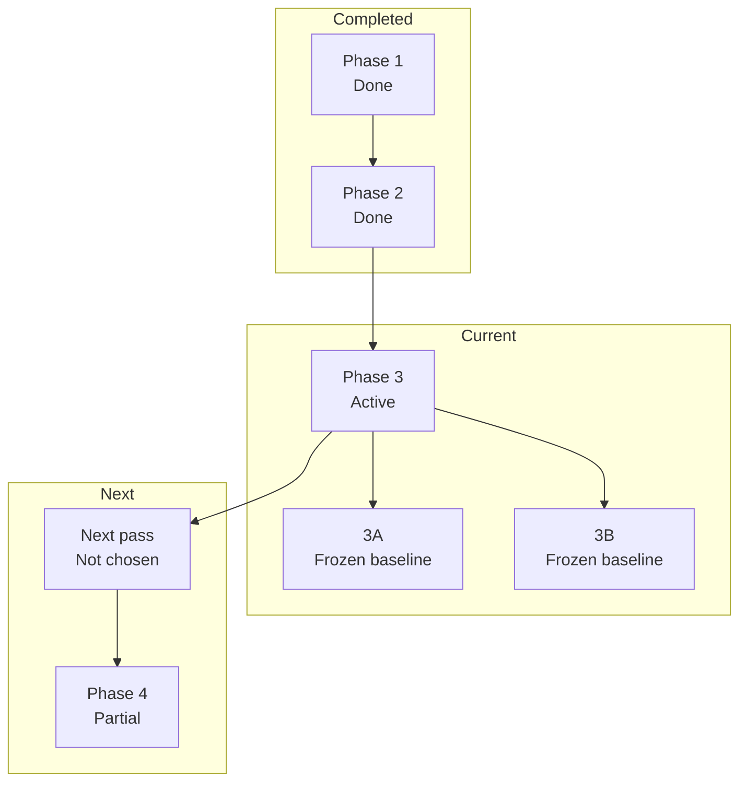

# Krukraft — Active Phase Tracker

Use this file as the single source of truth for active implementation state.

## Plan Snapshot

Parent Plan: `Dashboard-v2 stabilization and Vercel-like transition plan`

> [!info] Current Phase
> `Stabilized dashboard-v2 rollback baseline`

> [!success] Completed
> Phase 1: Loading Ownership Reset
> Phase 2: Shell-First Route Design

> [!warning] Active
> Phase 3: Prefetch And Timing Tuning

> [!tip] Frozen Baseline
> Phase 3A: nav prefetch uplift
> Phase 3B: creator/resources timing cleanup

> [!todo] Next Decision
> Choose the next deliberate route-level perf pass or another explicitly scoped follow-up

> [!abstract] Partial
> Phase 4: Durable UX Verification

## Status Board

| Track    | Status  | Note                                                                                               |
| -------- | ------- | -------------------------------------------------------------------------------------------------- |
| Phase 1  | Done    | ownership reset closed                                                                             |
| Phase 2  | Done    | shell-first loading contract active                                                                |
| Phase 3  | Active  | frozen baseline only                                                                               |
| Phase 3A | Frozen  | nav prefetch uplift                                                                                |
| Phase 3B | Frozen  | creator/resources timing cleanup                                                                   |
| Phase 4  | Partial | dashboard-v2 family and public↔dashboard handoff proofs are currently clean on the active baseline |

## Progress

Dashboard-v2 stabilization
`[███████░░░] 70%`

## Daily Workflow

Before starting:
- Read `Current Phase`
- Pick exactly one item from `Next Up`
- Move it to `In Progress`

Before closing:
- Update `In Progress`
- Update `Next Up`
- Fill `Session Close-Out Template`

Rules:
- Keep exactly one `Current Phase`
- Keep `Next Up` to at most 3 items
- Move anything not being worked right now into `Deferred`
- If a phase status changes, update this file in the same session
- If the parent plan status changes, update `Plan Snapshot`, `Current Status Inside Parent Plan`, and `Phase Map` in the same session
- Do not mark work complete in chat until the relevant phase/plan state here is updated
- If this file has an active parent plan, do not recommend or start `Deferred` work as the next step unless the user explicitly changes priorities
- When suggesting follow-up work, state whether it is `in-plan` or `out-of-plan` before recommending it
- If the user says `Next Up`, answer from the active plan's `Next Up` block first and keep the recommendation inside the active plan unless the user explicitly asks to reprioritize

---

## Current Phase

### Name
Stabilized dashboard-v2 rollback baseline

### Parent Plan
Dashboard-v2 stabilization and Vercel-like transition plan

### Current Status Inside Parent Plan
- Phase 1 is done
- Phase 2 is done
- Phase 3 is partial and intentionally frozen at a narrow baseline
- Phase 4 is partial
- The last deliberate follow-up on public account-menu parity and public↔dashboard library handoff is now green on the active baseline
- The latest local proof pass has `navigation-shells` and `navigation-sentinels` green after stabilizing the public `/resources` auth-viewer + dashboard library cold-entry boundary
- Public navbar and dashboard-v2 topbar now share one authenticated account-dropdown component and one IA/UI contract instead of maintaining separate menu implementations
- Marketplace navbar loading and dashboard-v2 topbar loading were re-audited after the shared dropdown/UI pass so their skeleton ownership and geometry match the current UI more closely
- The latest hydration warning sample on the public navbar was audited and is not an active reproducible crash right now; the remaining public proof issue is a dropdown click-through timeout flake in `navigation-sentinels`
- The public account-dropdown click-through timeout in `navigation-sentinels` is now green again after tightening the sentinel helper around the real dropdown activation contract and matching the helper timeout budget to the real public→dashboard dev compile boundary
- Shared authenticated account-dropdown rows now use direct link owners again for navigation instead of nested button owners
- The recurring one-pass local dev flake in `creator-workspace.spec.ts` was traced to the post-login cold-entry `page.goto(...)` path in `tests/e2e/helpers/auth.ts`; the helper now retries retryable cold-entry failures and waits only for `commit`, and the full suite is green again on the active baseline
- The learner account surface pass on `/dashboard-v2/settings` has now landed: the route streams its sections behind an in-page `Suspense` boundary again, while its route-level loading and proof surface were kept aligned
- The same `/dashboard-v2/settings` route is no longer a read-only summary surface: it now uses interactive profile, preferences, notification, and security sections, and the route/API surface no longer exposes a language selector for this page
- The same settings surface now also supports user-owned profile photo changes: `/api/user/profile/avatar` uploads the image, `/api/user/profile` persists the new `image` field, and the root client provider tree now includes `SessionProvider` so `useSession().update(...)` can refresh the dashboard/avatar chrome immediately after save
- Google-backed profile photos are now a first-class fallback path in settings too: Google sign-in syncs the provider image into `User.providerImage`, the settings profile panel exposes cleaner photo actions, and removing a custom upload restores the stored Google photo when one exists instead of dropping directly to initials
- The legacy `HomepageHero` and orphaned `PlatformTypographySettings` DB tables are now intentionally being removed instead of treated as active feature surfaces
- The learner account follow-up on `/dashboard-v2/membership` has now landed too: the route renders its intro shell first and streams the membership results body behind a matching in-page `Suspense` boundary instead of awaiting the whole account payload before first in-page content
- The same `/dashboard-v2/membership` route is now audit-clean enough to use as a real account surface: its intro CTA bar no longer freezes as skeleton buttons after readiness, free-plan users get live `Explore plans` + `View purchases` actions, and Stripe-backed members can cancel renewal from the route itself
- The route-specific membership proofs are green, while the remaining one-pass instability still presents as the older public sentinel / creator cold-entry dev flake classes rather than a confirmed `/dashboard-v2/membership` regression
- `tests/e2e/creator-workspace.spec.ts` is green again as the dashboard-v2 handoff baseline after filtering NextAuth client session fetch abort noise out of runtime-console failure collection
- Public → dashboard-v2 entry transitions were rechecked after the shell-only entry overlay pass, and `navigation-shells` is green again with no blank-gap evidence before route-owned loading takes over
- The public `/membership` page has now been rebuilt as a DS pricing surface
  instead of the older legacy marketing page, and `tests/e2e/membership-public.spec.ts`
  is green against the new route contract
- The same public `/membership` page has now been tightened again around a
  Linear-style, plan-first structure: left-aligned pricing heading, one billing
  toggle, three divider-separated plan columns, and a matching slimmed-down
  loading shell; the `Team` tier is no longer sales-only and now reuses the
  same Stripe-backed checkout flow class as `Pro`
- The next deliberate choice is open again after the `/dashboard-v2/settings` and `/dashboard-v2/membership` passes landed

### Goal
Keep the post-rollback dashboard-v2 baseline stable while reopening route-level perf only one route at a time and only after the previous narrow pass is actually closed with proof.

### Why this is the current phase
- The active perf baseline is intentionally limited to:
  - Phase 3A: nav prefetch uplift
  - Phase 3B: creator/resources timing cleanup
- A new narrow learner-account follow-up has now landed on top of that frozen baseline:
  - `/dashboard-v2/settings` streams its sections again behind an in-page `Suspense` boundary
  - `/dashboard-v2/membership` now streams its results body behind an in-page `Suspense` boundary after the intro shell renders
- Later broad route-level perf experiments were rolled back.
- Cleanup after rollback is done.
- The latest warm local verification pass for `tests/e2e/creator-workspace.spec.ts` passed `8/8`.

### Definition of Done
- [x] The next route-level perf pass is chosen intentionally
- [x] That pass is implemented for one route family only
- [x] Matching loading / fallback / route contract proof is updated
- [x] Runtime verification is rerun on the affected flow
- [x] Relevant context docs are updated in the same work session

### Phase Map

| Phase | Name | Status | Notes |
| --- | --- | --- | --- |
| 1 | Loading Ownership Reset | done | parent neutral fallbacks were removed from visible ownership |
| 2 | Shell-First Route Design | done | canonical dashboard-v2 routes now use shell-first loading contract |
| 3 | Prefetch And Timing Tuning | partial / frozen | keep only `Phase 3A nav prefetch uplift` and `Phase 3B creator/resources timing cleanup` in the active baseline |
| 4 | Durable UX Verification | partial | key dashboard-v2 handoff coverage exists, but future route-by-route work still needs matching proof when reopened |

---

## Current Goal

Choose and execute the next safe, narrow improvement without losing the stabilized rollback baseline.

Current recommendation order:
1. Runtime feel recheck on dashboard-v2 routes
2. Pick one narrow next pass:
   - learner account surface perf (`settings` first if needed)
   - account-menu parity audit
   - another route-specific perf pass only after proof

---

## In Progress

- [x] Runtime feel recheck across key dashboard-v2 routes
- [x] Public account-menu parity pass for IA and UI structure
- [x] Public↔dashboard library handoff stabilization after menu parity pass
- [x] Public `/resources` auth-viewer cold-entry stabilization after menu parity pass
- [x] Shared authenticated account dropdown for public + dashboard-v2
- [x] Marketplace navbar skeleton ownership/geometry pass after the shared dropdown refresh
- [x] Dashboard-v2 topbar skeleton pass to align loading geometry with the live navbar
- [x] Dashboard entry overlay now uses a shell-only dashboard bridge instead of a full generic dashboard content skeleton during public → dashboard handoff
- [x] Audit the recent public navbar hydration warning sample
- [x] Clean the remaining `navigation-sentinels` public account-dropdown click-through timeout
- [x] Restore stable link-owner navigation inside the shared authenticated account dropdown
- [x] Stabilize the recurring one-pass `creator-workspace.spec.ts` cold-entry flake at the auth helper boundary
- [x] Re-open the learner account surface perf pass on `/dashboard-v2/settings`
- [x] Re-open the learner membership surface perf pass on `/dashboard-v2/membership`
- [ ] Do not restart broad dashboard-v2 streaming work from memory
- [ ] Re-open perf only route-by-route with proof after each pass

---

## Next Up

- [ ] Decide the next deliberate follow-up after the `/dashboard-v2/settings` and `/dashboard-v2/membership` passes
- [ ] Re-evaluate whether the next narrow pass should be another learner account surface, a creator account surface, or a non-perf UX follow-up
- [ ] If the next pass is not chosen immediately, keep the tracker explicit about that instead of reopening work from memory

---

## Blocked / Waiting

- [ ] None right now

Use this section only for real blockers:
- missing env / credentials
- failing CI unrelated to the current task
- unclear product decision
- waiting on design / business confirmation

---

## Deferred

### Dashboard / Perf
- [ ] Revisit route-level perf passes beyond the current rollback baseline only one route at a time
- [ ] Recheck whether `membership`, `settings`, `creator/profile`, or the public creator storefront need additional runtime perf work after visual/runtime feel review
- [ ] Re-open earnings perf only if runtime feel proves it is still a hotspot after rollback baseline

### Public Route / Loading Follow-ups
- [ ] Finish route-family fallback cleanup on public routes so hard refreshes on `/resources` and similar pages stay inside family-specific or neutral shells
- [ ] Audit discover/search/filter/creator-profile fallbacks for usable-but-consistent loading states after the navbar/topbar skeleton pass
- [ ] Verify dashboard/admin hard refreshes no longer show the global app-root fallback before their family loading shells under repeated refresh stress

### Brand / Platform
- [ ] Re-run perf measurements after major listing/detail/search changes and update thresholds intentionally
- [ ] Recheck preview/production LCP after major marketplace image or layout changes
- [ ] Verify favicon and OG logo propagation through `/brand-assets/*` in production browsers and crawlers
- [ ] Recheck that the trimmed first-party brand asset set still covers every metadata/favicon surface

### Ops / Config
- [ ] Replace `XENDIT_SECRET_KEY` test key in production environment
- [ ] Verify `DIRECT_URL` is present and correct for Prisma CLI / migration workflows in production
- [ ] Keep post-deploy warm targets aligned with perf smoke and browser verification coverage

---

## Verification Baseline

Run these before claiming dashboard-v2 stabilization work is complete:

- `npm run typecheck`
- `npm run lint`
- `npm run context:check`
- `npm run test:e2e -- --project=chromium tests/e2e/creator-workspace.spec.ts`
- `npm run test:e2e -- --project=chromium tests/e2e/navigation-shells.spec.ts`
- `npm run test:e2e -- --project=chromium tests/e2e/navigation-sentinels.spec.ts`

If the task touches creator editor flows, also consider:
- `npm run test:e2e -- --project=chromium tests/e2e/dashboard-v2-creator-editor-route-family.spec.ts`
- `npm run test:e2e -- --project=chromium tests/e2e/dashboard-v2-creator-editor-hardening.spec.ts`

---

## Current Baseline Notes

### Dashboard-v2
- `dashboard-v2` is the only canonical dashboard family.
- Old `(dashboard)` and `(dashboard-lite)` route families were hard-cut and removed.
- Active runtime perf baseline keeps the original frozen core at:
  - nav prefetch uplift
  - creator/resources timing cleanup
- plus one new deliberate learner-account follow-up:
- `/dashboard-v2/settings` now streams its sections behind an in-page `Suspense` boundary again instead of awaiting the full combined payload before first in-page HTML
- `/dashboard-v2/settings` now renders a real interactive settings surface inside that streamed shell, and the dashboard-v2 settings route/API no longer accept a page-level language preference
- `/dashboard-v2/membership` now renders its intro shell before the membership payload resolves and streams the summary cards plus plan-status panel behind a route-matched in-page fallback instead of awaiting the full account payload before any in-page content

### Verification
- Warm local `creator-workspace.spec.ts` passed `8/8` after rollback cleanup and short flake stabilization.
- Treat that suite as the main dashboard-v2 regression gate unless a task clearly needs a narrower surface.
- Runtime feel recheck on 2026-04-14 still confirms the dashboard-v2 family suite passes, and the public follow-up that remained after that pass is now green too:
  - `tests/e2e/navigation-shells.spec.ts` passes for `/resources` ↔ `/dashboard-v2/library`
  - `tests/e2e/navigation-sentinels.spec.ts` passes for the public account dropdown contract
- Public account-menu parity pass now mirrors dashboard-v2 IA/UI on the marketplace header, including the redesigned `Membership` entry and creator links, and the follow-up stabilization work closed the remaining public `/resources` auth-viewer and library cold-entry proof failures on the active baseline.
- The `/dashboard-v2/settings` pass is now also green against:
  - `tests/e2e/settings-theme.spec.ts`
  - `tests/e2e/navigation-sentinels.spec.ts` (`dashboard avatar menu reaches home membership and settings`)
  - `tests/e2e/creator-workspace.spec.ts` (`dashboard-v2 account surfaces clear the dashboard overlay after shell readiness`)
- The `/dashboard-v2/membership` pass is green against:
  - `tests/e2e/dashboard-membership.spec.ts`
  - `tests/e2e/creator-workspace.spec.ts` (`dashboard-v2 account surfaces clear the dashboard overlay after shell readiness`)
  - `tests/e2e/navigation-shells.spec.ts`
- One-pass local reruns still surfaced the older public sentinel and creator cold-entry flake classes during this work session, but those failures happened outside the membership route contract itself

### Git / Repo Hygiene
- Local design-tool repos under `.design-tools/*` are intentionally not tracked by the main repo.

---

## Decision Log

Add only short, high-signal entries here.

- 2026-04-14: Keep dashboard-v2 perf baseline frozen after rollback; do not re-open broad streaming refactors.
- 2026-04-14: Remove `.design-tools/awesome-design-md` and `.design-tools/shadcn-examples` from repo tracking; keep them local-only.
- 2026-04-14: Runtime feel recheck shows dashboard-v2 internal route family is stable; next follow-up should target public↔dashboard library handoff/account-menu parity before reopening another perf pass.
- 2026-04-14: Public navbar account menu now follows the dashboard-v2 account-menu contract for IA/UI, but the next active follow-up remains public↔dashboard library handoff stabilization because `navigation-shells` still catches a blank-gap transition sample at that boundary.
- 2026-04-14: The authenticated account dropdown is now a shared public+dashboard component; keep sentinel coverage green when changing trigger shape, featured membership item, or account/creator menu sections.
- 2026-04-15: Marketplace navbar skeleton ownership and dashboard-v2 topbar skeleton geometry were both tightened after the shared dropdown refresh; the next public-nav follow-up is proof cleanliness, not another structural menu rewrite.
- 2026-04-15: The latest public navbar hydration warning sample points to a recoverable SSR/client mismatch around the auth-viewer boundary in dev, but it is not currently an active repro; treat the remaining public dropdown navigation timeout as the main open proof issue.
- 2026-04-15: `navigation-sentinels` is green again after tightening the public account-dropdown sentinel helper to use the real dropdown activation contract instead of an over-forced click path.

---

## Session Close-Out Template

Copy/update this at the end of a non-trivial task:

- Phase status:
  - `open` / `closed` / `deferred`
- Parent plan status changed?
  - `yes` / `no`
- What changed:
  - ...
- Verification run:
  - ...
- Next recommended task:
  - ...
- Knowledge triage:
  - `no ingest` / `log only` / `update existing wiki` / `new wiki entry`

Close-out rule:
- If `Phase status` changed, update `Plan Snapshot` and `Phase Map` before ending the session
- If the parent plan moved to a new stage or closed, update `Current Phase`, `Current Status Inside Parent Plan`, and `Next Up` before ending the session

### Phase Change Checklist

- [ ] Update `Phase status`
- [ ] Update `Plan Snapshot`
- [ ] Update `Phase Map`
- [ ] Update `Current Status Inside Parent Plan`
- [ ] Update `In Progress`
- [ ] Update `Next Up`
- [ ] Record verification actually run
- [ ] Record the next recommended task before closing the session

---

## Reference Pointers

Use these for deeper context instead of expanding this file again:
- Architecture / route-family behavior: [04-architecture.md](/Users/shanerinen/Projects/krukraft/krukraft-ai-contexts/04-architecture.md)
- Performance notes / rollback baseline: [08-performance-audit.md](/Users/shanerinen/Projects/krukraft/krukraft-ai-contexts/08-performance-audit.md)
- Design-system ownership: [06-design-system.md](/Users/shanerinen/Projects/krukraft/krukraft-ai-contexts/06-design-system.md)
- Layout / UX conventions: [07-layout-ux.md](/Users/shanerinen/Projects/krukraft/krukraft-ai-contexts/07-layout-ux.md)
